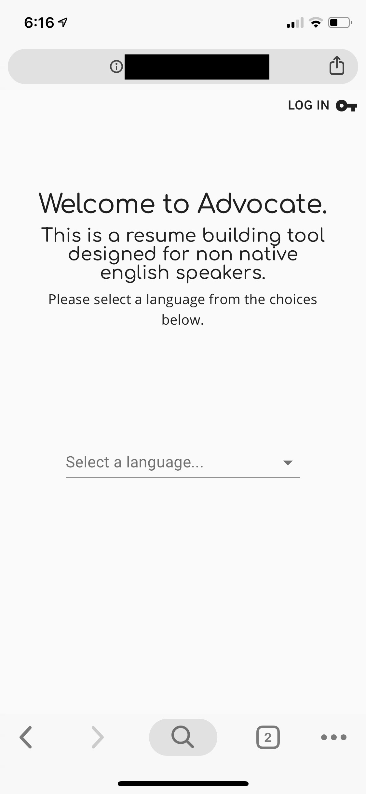

# Advocate
Fully responsive professional bio builder for refugees, immigrants and non-native English speakers.

## Abstract
Advocate aims to give non-English speakers an opportunity to communicate their capabilities by asking them questions in their own language, and then generating a professional bio in English based on their responses.  

Advocate has two different types of users - those who are building a professional bio for themselves (called basic users) and those who are requesting a bio from a non-english speaker (called advocates).  Those who are looking to hire non-english speakers are able to generate a link to be sent to the potential hire, who will then be taken into the bio building process.  The advocate will then have the results show in their own account.

### Usage
Advocate is intended to be as simple to use as possible, with each page typically only asking a single question.  Users will select a language, select what type of account they want to create, and then give relevant account info.  Advocate will then generate an account for them.  Alternatively, users who already have an account can log in at any time. 

Both basic users and advocate users are able to create a professional bio for themselves and view the result.  Advocate users are able to invite others to create a professional bio.  The link they generate will bring the new user into the professional bio building process.  Results are then shown on the advocate user's dashboard.  

### Demo

[Link](https://youtu.be/1EEimlSyFPY)

### Responsiveness
Advocate is designed to be fully responsive regardless of user screen size.  This is out of consideration that users that receive an invite link will likely receive the link over text message.

  

